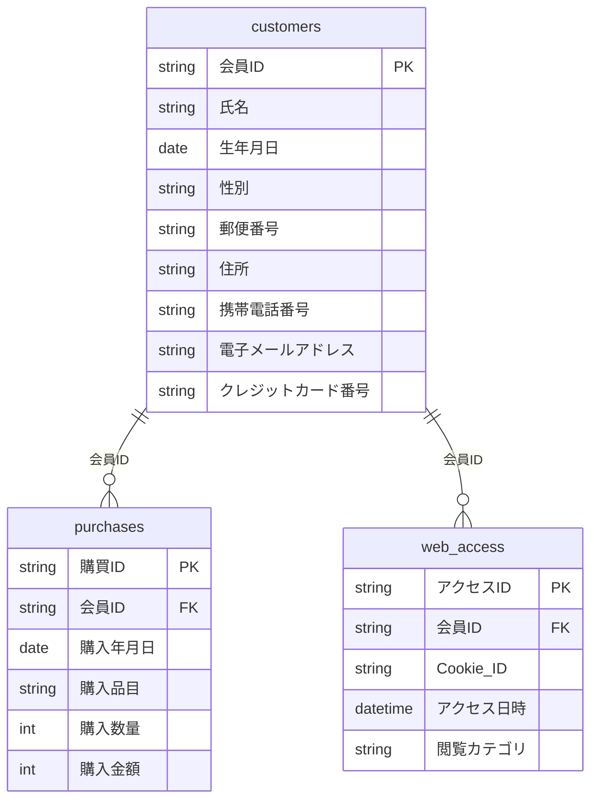

# case01（仮名加工情報）: 加工前テーブル定義書

> **このページで見ること**: 加工する「前」のデータが、どんな表（テーブル）と項目でできているか。3つのテーブルは会員IDでつながっています。

> 対象: 事例1。ダミーデータ（[02 仕様](02_dummy_data_spec.md)）の加工前スキーマ。項目は図表1-1 に対応〔報告〕、値・形式は教材用〔独自〕。

## データモデル（全体像）



## customers（顧客マスタ）

- 目的: 会員の属性情報を管理／1レコード=顧客1人／想定800件

| No. | 論理項目名 | 物理項目名 | データ型 | 形式・値域 | NULL | キー | 値の例 |
|-----|-----------|-----------|----------|-----------|------|------|--------|
| 1 | 会員ID | 会員ID | 文字列 | `M` + 6桁連番 | 不可 | PK | M000001 |
| 2 | 氏名 | 氏名 | 文字列 | 姓 名 | 不可 | | 佐藤 翔太 |
| 3 | 生年月日 | 生年月日 | 日付 | YYYY-MM-DD | 不可 | | 1985-04-12 |
| 4 | 性別 | 性別 | 文字列 | {男性, 女性} | 不可 | | 女性 |
| 5 | 郵便番号 | 郵便番号 | 文字列 | NNN-NNNN | 不可 | | 154-0000 |
| 6 | 住所 | 住所 | 文字列 | 都道府県+市区町村+丁目番地 | 不可 | | 東京都世田谷区3丁目12-5 |
| 7 | 携帯電話番号 | 携帯電話番号 | 文字列 | 0N0-NNNN-NNNN | 不可 | | 090-1234-5678 |
| 8 | 電子メールアドレス | 電子メールアドレス | 文字列 | email | 不可 | | m000001@example.com |
| 9 | クレジットカード番号 | クレジットカード番号 | 文字列 | 16桁 | 不可 | | 4000123456789012 |

## purchases（購買履歴）

- 目的: 購入トランザクション／1レコード=購入1件／想定約4,800件

| No. | 論理項目名 | 物理項目名 | データ型 | 形式・値域 | NULL | キー | 値の例 |
|-----|-----------|-----------|----------|-----------|------|------|--------|
| 1 | 購買ID | 購買ID | 文字列 | `P` + 7桁連番 | 不可 | PK | P0000001 |
| 2 | 会員ID | 会員ID | 文字列 | customers 参照 | 不可 | FK | M000001 |
| 3 | 購入年月日 | 購入年月日 | 日付 | YYYY-MM-DD | 不可 | | 2026-03-05 |
| 4 | 購入品目 | 購入品目 | 文字列 | 商品カテゴリ10種 | 不可 | | 野菜 |
| 5 | 購入数量 | 購入数量 | 整数 | 1〜5 | 不可 | | 2 |
| 6 | 購入金額 | 購入金額 | 整数 | 円（>0） | 不可 | | 1180 |

## web_access（Webアクセス履歴）

- 目的: 自社サイト閲覧ログ／1レコード=アクセス1件／想定約8,000件

| No. | 論理項目名 | 物理項目名 | データ型 | 形式・値域 | NULL | キー | 値の例 |
|-----|-----------|-----------|----------|-----------|------|------|--------|
| 1 | アクセスID | アクセスID | 文字列 | `A` + 8桁連番 | 不可 | PK | A00000001 |
| 2 | 会員ID | 会員ID | 文字列 | customers 参照 | 不可 | FK | M000001 |
| 3 | Cookie ID | Cookie_ID | 文字列 | 16桁hex | 不可 | | 3f9a1c8b2d4e6f70 |
| 4 | アクセス日時 | アクセス日時 | 日時 | ISO8601 | 不可 | | 2026-03-05T14:22:00 |
| 5 | 閲覧カテゴリ | 閲覧カテゴリ | 文字列 | 商品カテゴリ10種 | 不可 | | 果物 |

## リレーション

```
customers (会員ID) 1 ──< purchases (会員ID)
customers (会員ID) 1 ──< web_access (会員ID)
```
