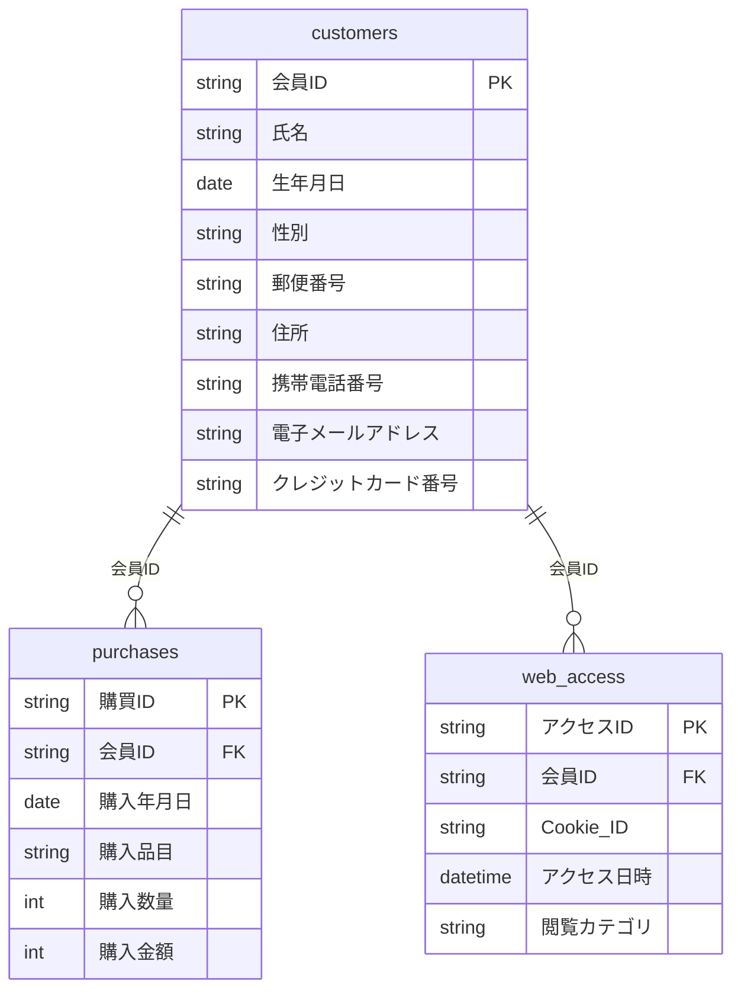

# case01（仮名加工情報）: データを見る（加工前テーブル定義） — 2/7

加工プロセス
{ .wizard-cap }

1. [全体概要](01_case_summary.md)
2. **データ概要理解**
3. [データ詳細理解](04_column_classification.md)
4. [加工設計](05_processing_design.md)
5. [加工仕様](06_processing_spec.md)
6. [実装](notebook.md)
7. [結果確認](09_results.md)

> 加工する「前」のデータが、どんな表（テーブル）と項目でできているか。まず全体像をつかみます。3つのテーブルは **会員ID** でつながっています。

## 全体像

| テーブル | 役割 | 主キー | 1レコード | 想定件数 |
|----------|------|--------|-----------|----------|
| `customers` | 顧客の属性情報 | 会員ID | 顧客1人 | 800 |
| `purchases` | 購買トランザクション | 購買ID | 購入1件 | 約4,800 |
| `web_access` | 自社サイト閲覧ログ | アクセスID | アクセス1件 | 約8,000 |

顧客の属性（`customers`）は 9 項目。この中に、氏名・住所・電話・メール・カード番号など **そのままでは個人が特定できる／連絡できてしまう項目** が含まれています。次ページで、各項目の性質を評価します。

??? example "実データのサンプル（先頭3行・すべて合成データ）"
    **customers**

    | 会員ID | 氏名 | 生年月日 | 性別 | 郵便番号 | 住所 | 携帯電話番号 | 電子メールアドレス | クレジットカード番号 |
    |--------|------|----------|------|----------|------|--------------|--------------------|----------------------|
    | M000001 | 松本 直樹 | 1991-11-09 | 男性 | 192-0000 | 東京都八王子市3丁目7-18 | 080-8643-3829 | m000001@example.com | 4321469208498442 |
    | M000002 | 高橋 愛 | 1977-12-19 | 女性 | 166-0000 | 東京都杉並区3丁目5-1 | 080-2396-9995 | m000002@example.com | 4484765306802001 |
    | M000003 | 中村 直樹 | 1981-06-10 | 男性 | 192-0000 | 東京都八王子市5丁目1-3 | 080-4489-2757 | m000003@example.com | 4242652328741924 |

    **purchases**

    | 購買ID | 会員ID | 購入年月日 | 購入品目 | 購入数量 | 購入金額 |
    |--------|--------|------------|----------|----------|----------|
    | P0000001 | M000001 | 2026-04-18 | 精肉 | 3 | 3093 |
    | P0000002 | M000001 | 2025-12-07 | 飲料 | 5 | 1740 |
    | P0000003 | M000001 | 2026-01-12 | 野菜 | 2 | 1124 |

    値はすべて教材用の合成データで、実在の個人・値とは無関係です。「加工前はこれだけ生々しい情報が並ぶ」という出発点を確認してください。

## 項目定義（詳細）

??? note "customers（顧客マスタ）"
    | No. | 項目 | データ型 | 形式・値域 | キー | 値の例 |
    |-----|------|----------|-----------|------|--------|
    | 1 | 会員ID | 文字列 | `M` + 6桁連番 | PK | M000001 |
    | 2 | 氏名 | 文字列 | 姓 名 | | 佐藤 翔太 |
    | 3 | 生年月日 | 日付 | YYYY-MM-DD | | 1985-04-12 |
    | 4 | 性別 | 文字列 | {男性, 女性} | | 女性 |
    | 5 | 郵便番号 | 文字列 | NNN-NNNN | | 154-0000 |
    | 6 | 住所 | 文字列 | 都道府県+市区町村+丁目番地 | | 東京都世田谷区3丁目12-5 |
    | 7 | 携帯電話番号 | 文字列 | 0N0-NNNN-NNNN | | 090-1234-5678 |
    | 8 | 電子メールアドレス | 文字列 | email | | m000001@example.com |
    | 9 | クレジットカード番号 | 文字列 | 16桁 | | 4000123456789012 |

??? note "purchases（購買履歴）"
    | No. | 項目 | データ型 | 形式・値域 | キー | 値の例 |
    |-----|------|----------|-----------|------|--------|
    | 1 | 購買ID | 文字列 | `P` + 7桁連番 | PK | P0000001 |
    | 2 | 会員ID | 文字列 | customers 参照 | FK | M000001 |
    | 3 | 購入年月日 | 日付 | YYYY-MM-DD | | 2026-03-05 |
    | 4 | 購入品目 | 文字列 | 商品カテゴリ10種 | | 野菜 |
    | 5 | 購入数量 | 整数 | 1〜5 | | 2 |
    | 6 | 購入金額 | 整数 | 円（>0） | | 1180 |

??? note "web_access（Webアクセス履歴）"
    | No. | 項目 | データ型 | 形式・値域 | キー | 値の例 |
    |-----|------|----------|-----------|------|--------|
    | 1 | アクセスID | 文字列 | `A` + 8桁連番 | PK | A00000001 |
    | 2 | 会員ID | 文字列 | customers 参照 | FK | M000001 |
    | 3 | Cookie ID | 文字列 | 16桁hex | | 3f9a1c8b2d4e6f70 |
    | 4 | アクセス日時 | 日時 | ISO8601 | | 2026-03-05T14:22:00 |
    | 5 | 閲覧カテゴリ | 文字列 | 商品カテゴリ10種 | | 果物 |

→ 次に [情報特性の評価](04_column_classification.md) で、どの列がどれだけ危険か・分析に必要かを見極めます。

> 使用する合成データの作り方は [デモデータについて](02_dummy_data_spec.md) を参照。
