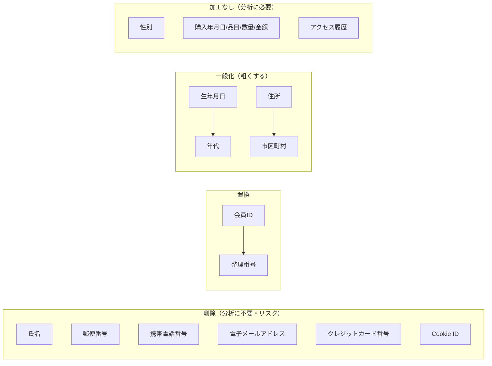

# case01（仮名加工情報）: 加工の設計

事例 → データを見る → 情報特性 → **加工設計** → 加工仕様 → 実装 → 結果
{ .process-nav }

> 各項目を「削除する／置き換える／粗くする／そのまま残す」のどれにするか、そしてその理由。判断は **識別性 × 機微度 × 利用目的上の必要性 × 必要粒度** の掛け合わせで決めます。

## 加工方針の全体像

考え方はシンプルです。**分析に要らず特定につながる項目は削る。特定はしたくないが分析には要る項目は、必要な粗さまで一般化して残す。個人単位の履歴は整理番号でつなぐ。**

??? note "利用目的から見た「必要な情報・粒度」"
    利用目的: 地域ごとに、どの顧客層（年代・性別）がどの商品に関心を持つかを分析し、実店舗の出店計画を検討する。

    | 分析 | 必要な情報 | 必要な粒度 |
    |------|-----------|-----------|
    | 地域別の顧客層分析 | 居住地域 | 市区町村単位（商圏判定） |
    | 顧客層（年齢）別分析 | 年齢 | 10歳区切りの年代 |
    | 顧客層（性別）別分析 | 性別 | そのまま |
    | 商品関心の分析 | 購入品目・年月日・金額 | できる限り加工しない |
    | 閲覧→購入・反応の分析 | アクセス履歴 | そのまま |

??? note "項目ごとの加工方針（識別性 × 機微度 × 必要性 × 必要粒度）"
    | 項目 | 識別性 | 機微度 | 必要性 | 必要粒度 | 加工方針 | 理由 |
    |------|--------|--------|--------|----------|----------|------|
    | 会員ID | 低(単体) | 低 | 履歴結合に必要 | ― | **整理番号へ置換** | 分析に不要＋識別禁止義務の抵触リスク低減 |
    | 氏名 | 高 | 中 | 不要 | ― | **削除** | 直接識別子 |
    | 生年月日 | 準 | 中 | 必要 | 10歳区切り | **年代へ一般化** | 詳細日付は不要、識別リスク低減 |
    | 性別 | 準 | 低 | 必要 | そのまま | **加工しない** | 生年月日・住所を加工済み |
    | 郵便番号 | 準 | 低 | 不要 | ― | **削除** | 加工後の住所で代替 |
    | 住所 | 準 | 中 | 必要 | 市区町村 | **市区町村へ一般化** | 商圏判定に十分な粒度 |
    | 携帯電話番号 | 高 | 中 | 不要 | ― | **削除** | 本人到達性・共用性 |
    | 電子メールアドレス | 高 | 中 | 不要 | ― | **削除** | 本人到達性・共用性 |
    | クレジットカード番号 | 高 | 高 | 不要 | ― | **削除** | 財産的被害のおそれ |
    | Cookie ID | 低 | 中 | 不要 | ― | **削除** | 本人到達性、会員IDを識別子に使用 |
    | アクセス履歴 | 低 | 低 | 必要 | そのまま | **加工しない** | 閲覧→購入・反応分析に必要 |
    | 購入年月日・品目・数量・金額 | 低 | 低 | 必要 | そのまま | **加工しない** | 購買動向分析に必要 |

→ 具体的な Python 処理は [加工仕様](06_processing_spec.md)、加工後のスキーマは [加工後テーブル定義](07_table_definition_after.md)。
