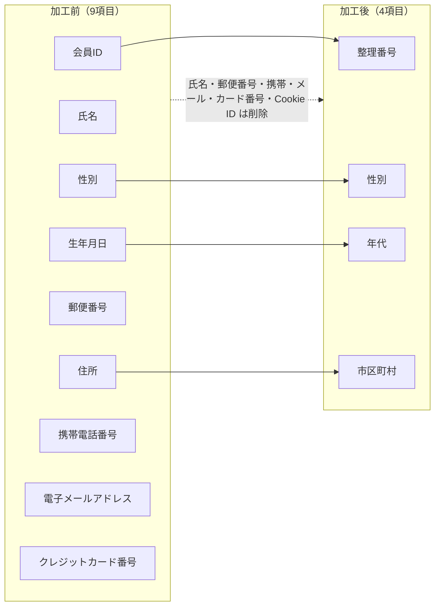

# ③ 加工結果とチェック — 7/7

加工プロセス
{ .wizard-cap }

1. [全体概要](01_case_summary.md)
2. [データ概要理解](03_table_definition_before.md)
3. [データ詳細理解](04_column_classification.md)
4. [加工設計](05_processing_design.md)
5. [加工仕様](06_processing_spec.md)
6. [実装](notebook.md)
7. **結果確認**

> [② 実装（Colab）](notebook.md) の Notebook をコミット済みデータに対して実行した結果です（決定的なので Colab 実行と一致します）。加工後スキーマは [加工後テーブル定義](07_table_definition_after.md) を参照。

## 加工前後の比較

顧客マスタは **9項目 → 4項目** に縮約されました。直接だれかを特定できる情報は消え、分析に必要な粗い属性だけが残ります。

- **削除**: 氏名 / 郵便番号 / 携帯電話番号 / 電子メールアドレス / クレジットカード番号 / Cookie ID
- **一般化**: 生年月日 → 年代（10歳区切り）、住所 → 市区町村
- **置換**: 会員ID → 整理番号（3テーブル共通、履歴結合を維持）
- **維持**: 性別、購入年月日・品目・数量・金額、アクセス日時・閲覧カテゴリ

## 確認テスト結果（すべて合格）

- [x] 削除対象カラムが存在しない（氏名・郵便番号・住所・携帯・メール・カード番号・会員ID・Cookie ID）
- [x] 必要な加工後カラム（整理番号・性別・年代・市区町村）が存在する
- [x] レコード数が意図せず変化していない（customers 800 / purchases 4,789 / web_access 7,959）
- [x] 同一人物の履歴関係が整理番号で維持されている（purchases・web_access の整理番号 ⊆ customers）

## 加工後データによる分析（利用目的の再現）

加工後データでも、利用目的（地域 × 顧客層 × 商品関心）の分析が成立します。

**年代別 平均購入金額（円）**:

| 年代 | 10代 | 20代 | 30代 | 40代 | 50代 | 60代 | 70代 | 80代 |
|------|------|------|------|------|------|------|------|------|
| 平均 | 3,877 | 3,064 | 3,430 | 3,662 | 3,682 | 4,045 | 4,115 | 4,243 |

**市区町村別 平均購入金額（上位5）**:

| 市区町村 | 平均（円） |
|----------|-----------|
| 東京都大田区 | 4,401 |
| 東京都八王子市 | 4,315 |
| 東京都世田谷区 | 3,870 |
| 東京都練馬区 | 3,818 |
| 東京都江戸川区 | 3,796 |

**年代別 購入品目トップ3**:

- 20代: 飲料 / 惣菜 / 菓子
- 70代: 米・穀物 / 精肉 / 野菜

> 市区町村単位・年代単位で「どの地域のどの顧客層がどの商品に関心を持つか」を読み取れる＝**出店計画の検討という利用目的が、加工後も達成できる**ことを示します。
