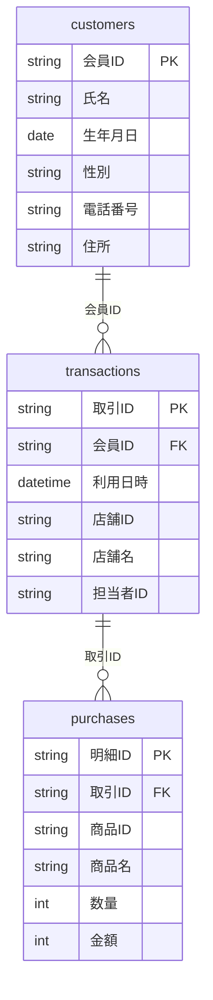

# case02（匿名加工情報）: データを見る（加工前テーブル定義） — 2/7

加工プロセス
{ .wizard-cap }

1. [全体概要](01_case_summary.md)
2. **データ概要理解**
3. [データ詳細理解](04_column_classification.md)
4. [加工設計](05_processing_design.md)
5. [加工仕様](06_processing_spec.md)
6. [実装](notebook.md)
7. [結果確認](09_results.md)

> 加工する「前」の ID-POS データの構造です。3つのテーブルは **会員ID** でつながっています（図表2-2）。

## 全体像

| テーブル | 役割 | 主キー | 1レコード | 想定件数 |
|----------|------|--------|-----------|----------|
| `customers`（顧客属性） | 会員の基本属性 | 会員ID | 顧客1人 | 900 |
| `transactions`（取引情報） | 来店・会計1回 | 取引ID | 取引1件 | 約4,600 |
| `purchases`（購買履歴） | 買った商品の明細 | 明細ID | 明細1行 | 約14,000 |

顧客属性には氏名・電話・住所など**そのままでは個人が特定できる項目**が、取引・購買には**利用日時・店舗・珍しい商品**など**組み合わせると特定につながる項目**が含まれます。次ページで各項目の性質を評価します。

??? example "実データのサンプル（先頭数行・すべて合成データ）"
    **customers**

    | 会員ID | 氏名 | 生年月日 | 性別 | 電話番号 | 住所 |
    |--------|------|----------|------|----------|------|
    | M000003 | 渡辺 遥 | 1974-12-09 | 女性 | 090-6124-8185 | 千葉県市川市国府台5丁目29-1 |
    | M000004 | 木村 さくら | 1958-10-06 | 女性 | 090-6161-2924 | 東京都世田谷区上北沢3丁目13-15 |
    | M000005 | 吉田 聡 | 1975-11-20 | 男性 | 090-8202-2110 | 神奈川県川崎市宮前区宮崎5丁目17-11 |

    **transactions**

    | 取引ID | 会員ID | 利用日時 | 店舗ID | 店舗名 | 担当者ID |
    |--------|--------|----------|--------|--------|----------|
    | T0000001 | M000001 | 2026-03-17 19:30:28 | S06 | PPCマート浦和店 | E007 |
    | T0000002 | M000001 | 2026-03-09 12:31:50 | S07 | PPCマート船橋店 | E015 |

    **purchases**

    | 明細ID | 取引ID | 商品ID | 商品名 | 数量 | 金額 |
    |--------|--------|--------|--------|------|------|
    | D00000001 | T0000001 | G12 | 緑茶ペットボトル | 3 | 412 |
    | D00000002 | T0000001 | G07 | さば | 3 | 1251 |

    値はすべて教材用の合成データで、実在の個人・店舗・値とは無関係です。

> 合成データの作り方は [デモデータについて](02_dummy_data_spec.md) を参照。
