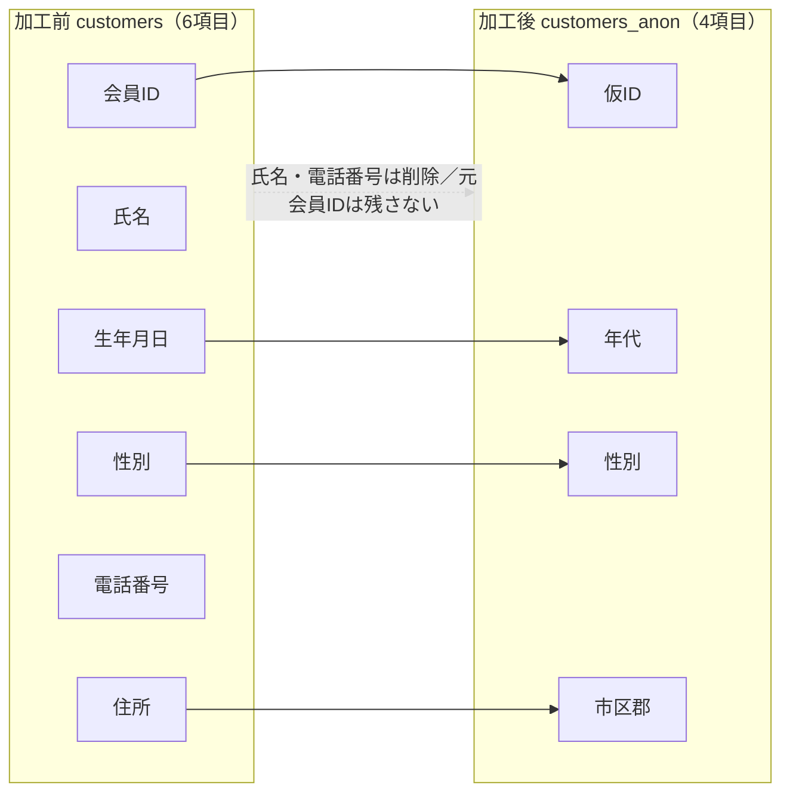

# ③ 加工結果とチェック — 7/7

加工プロセス
{ .wizard-cap }

1. [全体概要](01_case_summary.md)
2. [データ概要理解](03_table_definition_before.md)
3. [データ詳細理解](04_column_classification.md)
4. [加工設計](05_processing_design.md)
5. [加工仕様](06_processing_spec.md)
6. [実装](notebook.md)
7. **結果確認**

> [② 実装（Colab）](notebook.md) の Notebook をコミット済みデータに対して実行した結果です（決定的なので Colab 実行と一致します）。加工後スキーマは [加工後テーブル定義](07_table_definition_after.md) を参照。

## データ規模

| テーブル | 件数 |
|----------|------|
| customers | 900 |
| transactions | 4,600 |
| purchases | 13,984 |

## 加工前後の比較

顧客属性は **6項目 → 4項目** に縮約されました。直接識別子・連結符号（元会員ID）・特異な記述が消え、分析に必要な粗い属性だけが残ります。

- **置換**: 会員ID → 仮ID（対応表は残さない。34条3号）
- **削除**: 氏名・電話番号（34条1号）／店舗ID・取引ID・担当者ID・商品ID・明細ID（不要・再識別リスク低減）
- **一般化**: 生年月日 → 年代7区分、住所 → 市区郡、利用日時 → 分単位
- **特異値処理（34条4号）**: 商品名 → カテゴリ、数量 → 上限5で丸め、金額 → 金額区分
- **維持**: 性別・店舗名（他項目の加工で特定性が下がるため）

加工後の購買履歴は `仮ID / 利用日時（分） / 店舗名 / 商品カテゴリ / 数量 / 金額区分`。

## 確認テスト結果（すべて合格）

- [x] 元の会員ID・氏名・電話番号・生年月日・住所が加工後データに存在しない
- [x] 仮IDが一意（900件）で、顧客属性と購買履歴を仮IDで結合できる
- [x] 利用日時に秒が残っていない（分単位）
- [x] 商品名が消えてカテゴリ化され、数量は上限5、金額は区分になっている
- [x] レコード数が意図せず変化していない（purchases 13,984）

## 該当者の人数を確認する — 丸めの度合が十分か

レポートは、丸めの度合を **該当者の人数・データセットの大きさ・人口の多寡に応じて（可変に）判断**する、としています。そこで準識別子の組合せ **(年代 × 性別 × 市区郡)** ごとの人数を数え、該当者の少ない組合せがないかを見ます。

| 指標 | 値 |
|------|----|
| 組合せの数 | 129 |
| 最も少ない組合せの人数 | 1 |
| 該当者が少ない組合せ（目安: 5名未満） | 37 組合せ（107 名） |

!!! note "該当者が少ない組合せへの対応（このデモは小規模）"
    このデモは **900件と小規模**なため、市区郡・年代・性別まで残すと**該当者が数名以下の組合せが出やすく**なります。実務では、レポートの考え方に沿って次のように調整します。

    - **丸めの度合を粗くする**（例: 市区郡 → 都道府県、年代の区分をまとめる）
    - **データセットを大きくする**（対象人数が増えれば同じ丸めでも各組合せの人数が増える）
    - 該当者が極端に少ない値は **削除**する

    つまり「固定の基準値（k）を必ず満たす」というより、**該当者の人数やデータ量に応じて丸めを調整する**のが要点です。仮名加工（case01）が「照合しなければ特定できない」状態づくりだったのに対し、匿名加工は**丸めの度合を対象データに合わせて設計する**ぶん、ひと手間増えます。

## 加工後データによる分析（属性 × 購買傾向）

匿名加工の後でも、提供先が求める「どんな属性の人が、どんな商品を買うか」の分析は成立します。

**年代別 購入カテゴリ トップ3**:

- 20代: 惣菜・パン / 菓子 / 飲料
- 40代: 果物 / 野菜 / 精肉
- 70歳以上: 野菜 / 菓子 / 鮮魚

**年代別 金額区分の構成（割合・一部）**:

| 年代 | 〜499 | 500〜999 | 1,000〜1,999 | 2,000〜4,999 | 5,000円以上 |
|------|-------|----------|--------------|--------------|-------------|
| 20代 | 0.50 | 0.29 | 0.14 | 0.06 | 0.02 |
| 40代 | 0.45 | 0.33 | 0.14 | 0.05 | 0.03 |
| 70歳以上 | 0.41 | 0.34 | 0.15 | 0.06 | 0.03 |

> 年代で購入カテゴリの傾向が異なる＝**属性 × 購買傾向の分析が匿名加工後も成立**します。一方で、上の「該当者の人数」の確認のとおり、実際の提供ではデータ量に応じて丸めの度合を調整する必要がある点に注意してください。

## 制度上の取り扱い（提供時）

匿名加工情報を第三者提供する際は、**含まれる情報の項目の公表**、**提供方法の公表と匿名加工情報である旨の明示**、**識別行為の禁止**などの取り扱いが求められます（詳細は最新のガイドラインで確認）。

---

↩ もう一度確かめる: [② Colab で自分で実行](notebook.md) ／ [① 加工の設計](05_processing_design.md) に戻る。
